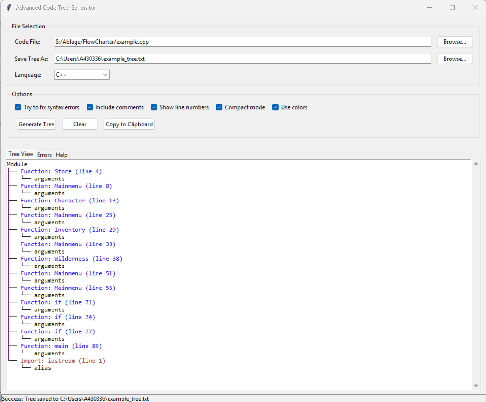

> [!IMPORTANT]
> **Dieses Repository ist umgezogen und wird auf GitHub nicht mehr gepflegt.**
> Die aktuelle Version und die weitere Entwicklung gibt es nur noch auf Codeberg:
> **https://codeberg.org/Flying-Bolt/Nassi-Schneidermann**

---

# Nassi-Shneidermann & Code-Tree Diagram Generator

Zwei Desktop-Tools zur automatischen Visualisierung von Quellcode-Strukturen – als **grafisches Nassi-Shneidermann-Struktogramm** oder als **hierarchischer Code-Tree**. Unterstützt Python, C++, C# und Kotlin.


---

## Zwei Lösungen im Überblick

| | `Nassi-Schneidermann.py` | `Code Tree Diagramm.py` |
|---|---|---|
| **Darstellung** | Grafisches Struktogramm (Nassi-Shneidermann) | Hierarchischer Code-Tree (Text/ASCII) |
| **GUI-Framework** | PyQt5 | tkinter |
| **Syntax-Highlighting** | Python, C++, Kotlin | — |
| **Sprachen** | Python, C++, Kotlin | Python, C++, C#, Kotlin |
| **C++-Parser** | Regex-basiert | Clang (mit Regex-Fallback) |
| **Besonderheiten** | Element-Auswahl-Dialog, Tab-Ansicht | Auto-Installer, Clang-Integration |

---

## Lösung 1 – Nassi-Shneidermann-Struktogramm (`Nassi-Schneidermann.py`)

Ein grafisches Tool zur Erzeugung echter **Nassi-Shneidermann-Struktogramme** nach DIN 66261. Der Quellcode wird eingelesen, geparst und direkt als formatiertes Struktogramm im Textbereich dargestellt – mit Syntax-Highlighting und gezielter Element-Auswahl.

### Screenshot


### Features

- **Echte Struktogramme** – Sequenz, Selektion, Schleifen, Fehlerbehandlung korrekt dargestellt
- **Syntax-Highlighting** – für Python, C++ und Kotlin
- **Element-Auswahl-Dialog** – gezielt einzelne Klassen und Methoden auswählen
- **Tab-Ansicht** – Code und Diagramm nebeneinander
- **Statusleiste** – zeigt aktuellen Status der Diagramm-Erzeugung

### Starten

```bash
pip install PyQt5
python "Nassi-Schneidermann.py"
```

### Unterstützte Sprachkonstrukte

| Konstrukt | Darstellung |
|-----------|-------------|
| Sequenz | Einfaches Rechteck |
| `if / else` | Entscheidungsblock |
| `for / while / do-while` | Schleifenblock |
| `try / except / finally` | Fehlerbehandlungsblock |
| `class` / `def` | Hierarchische Blöcke |
| Funktionsaufruf | Eingerückter Aufrufblock |
| `import` / `return` / `assert` | Einfache Anweisungsblöcke |

---

## Lösung 2 – Code-Tree-Diagramm (`Code Tree Diagramm.py`)

Ein leistungsstarkes Tool zur Analyse und Darstellung von Quellcode als **hierarchischer Baum**. Nutzt optional den Clang-Compiler für präzise C/C++-Analyse, fällt bei fehlendem Clang automatisch auf Regex zurück.

### Screenshot – Beispiel 1: Spielmenü (`example.cpp`)

Ein klassisches textbasiertes Abenteuerspiel-Menü mit Funktionen für Store, Character, Inventory und Wilderness.



---

### Screenshot – Beispiel 2: Factory Pattern (`example II.cpp`)

Modernes C++ mit Templates, `std::unique_ptr`, `std::function` und generischem Factory-Pattern.


### Features

- **Clang-Integration** – präzise C/C++-Analyse mit automatischem Regex-Fallback
- **Breite Sprachunterstützung** – Python, C/C++, C#, Kotlin
- **Auto-Installer** – fehlende Python-Module werden automatisch nachinstalliert
- **Mehrere Parser** – sprachspezifische Analyse für optimale Ergebnisse

### Starten

```bash
python "Code Tree Diagramm.py"
```

*(Benötigte Module werden beim ersten Start automatisch installiert.)*

---

## Enthaltene C++-Beispieldateien

### `example.cpp` – Spielmenü (Beginner)

```cpp
void Mainmenu() {
    string choice;
    cout << "1: Attack creature" << endl;
    cout << "2: Buy equipment"   << endl;
    cin >> choice;
    if (choice == "1") Wilderness();
    else if (choice == "2") Store();
    // ...
}
```

Demonstriert: Sequenz, Selektion (`if / else if / else`), Schleifen mit `goto`, Arrays, String-Eingabe

---

### `example II.cpp` – Factory Pattern (Advanced)

```cpp
template <typename Base, typename... Args>
class Factory {
public:
    template <typename Derived>
    void registerType(const std::string& name);
    std::unique_ptr<Base> create(const std::string& name, Args... args) const;
private:
    std::map<std::string, CreatorFunc> creators;
};
```

Demonstriert: Vererbung, virtuelle Methoden, Templates, Smart Pointer, Lambda, `static_assert`

---

### `BankAccount_Example.cpp` – Bankkonto OOP-System

Demonstriert: `enum class`, `struct`, `class` mit privaten Membern, Ausnahmebehandlung (`throw / try / catch`), `<iomanip>`, `<vector>`

---

## Installation

### 1. Repository klonen

```bash
git clone https://github.com/Flying-Bolt/Nassi-Schneidermann.git
cd Nassi-Schneidermann
```

### 2. Abhängigkeiten installieren

Für `Nassi-Schneidermann.py` (PyQt5-basiert):

```bash
pip install PyQt5
```

Für `Code Tree Diagramm.py` (tkinter, Standardbibliothek):

```bash
# Keine Installation notwendig – Module werden beim Start automatisch geprüft
```

Optional – für bessere C/C++-Analyse:

```bash
# clang installieren (https://releases.llvm.org/) und zum PATH hinzufügen
```

---

## Projektstruktur

```
Nassi-Schneidermann/
├── Nassi-Schneidermann.py        # Lösung 1: Grafische Nassi-Shneidermann-Struktogramme (PyQt5)
├── Code Tree Diagramm.py         # Lösung 2: Hierarchischer Code-Tree (tkinter + Clang)
├── example.cpp                   # Beispiel: Spielmenü (Beginner)
├── example II.cpp                # Beispiel: Factory Pattern (Advanced)
├── BankAccount_Example.cpp       # Beispiel: Bankkonto OOP-System
├── NASSI Schneidermann.png       # Screenshot – Nassi-Shneidermann-Diagramm
├── PrtScr.png                    # Screenshot – Code Tree: example.cpp
├── PrtScr II.png                 # Screenshot – Code Tree: example II.cpp
├── .gitignore
└── README.md
```

---

## Technische Details

### Abhängigkeiten

| Paket | Tool | Zweck |
|-------|------|-------|
| `PyQt5` | Nassi-Schneidermann.py | GUI, Syntax-Highlighting |
| `tkinter` | Code Tree Diagramm.py | GUI (Python-Standardbibliothek) |
| `ast` | beide | Python-Code-Analyse |
| `re` | beide | Regex-basiertes Parsen |
| `clang` | Code Tree Diagramm.py | Optionaler C/C++-Parser |

### Python-Versionen

| Version | Kompatibilität |
|---------|---------------|
| Python 3.8 – 3.9 | Vollständig kompatibel |
| Python 3.10+ | Vollständig kompatibel (ast.arguments gefixt) |
| Python 3.13 | Getestet und lauffähig |

---

## Lizenz

Dieses Projekt steht unter der [MIT-Lizenz](LICENSE).

---

## Mitwirken

Pull Requests sind willkommen. Bitte öffnen Sie bei größeren Änderungen zuerst ein Issue.
